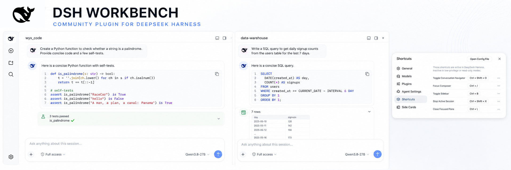
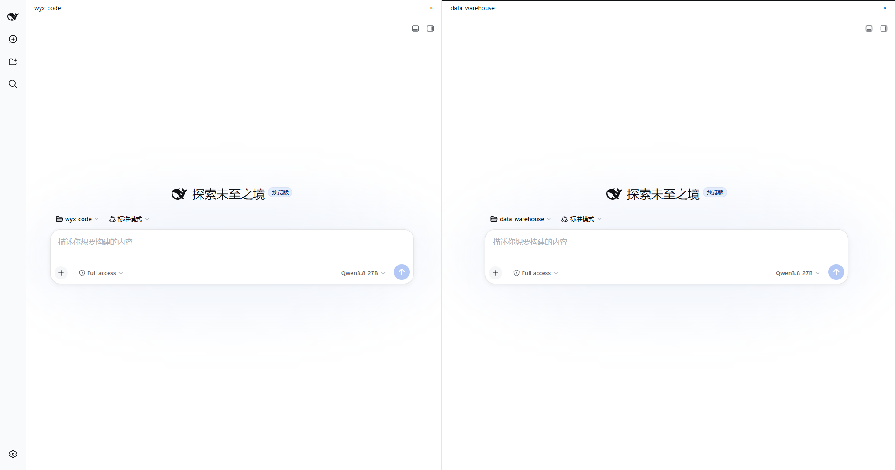
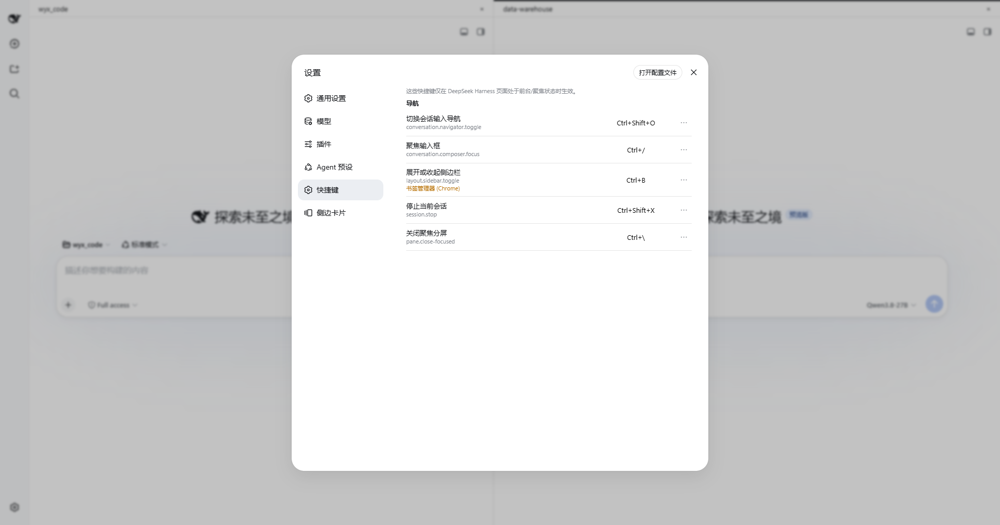

<p align="center">
  
</p>

<p align="center">
  A two-Pane workspace for DeepSeek Harness Web, with independent navigation, shortcuts, and optional side panels for each Session.
</p>

<p align="left">
  <a href="README.md">简体中文</a> · <strong>English</strong>
</p>

<p align="center">
  
  
  
  
  <a href="LICENSE"></a>
</p>

> [!IMPORTANT]
> Version `0.2.0-rc.1` is a source preview, not a one-command npm release. Split Pane requires the pinned Harness fork. Better Sidebar and Panel Compatibility are entirely optional. This project never installs, updates, or modifies a third-party plugin automatically.

> [!TIP]
> **One-line install prompt: send the complete sentence below to DeepSeek Harness**
>
> ```text
> Install DSH Workbench from https://github.com/wanyexin1998/dsh-workbench: first ask me for a full 40-character Workbench commit obtained from an independent trusted channel and stop if I do not provide one; require a nonexistent target directory, use git clone --no-checkout and checkout --detach that commit, stop after every failed Git command, and verify detached HEAD, a completely clean worktree, and case-insensitive exact equality between git rev-parse --verify HEAD and the supplied commit; only after every check succeeds may you read executable repository instructions and run pnpm install --frozen-lockfile and pnpm release:check, then install the generated Workbench TGZ into the web profile; install Panel Compatibility only when a compatible Better Sidebar fork is already present, never install or replace a third-party plugin automatically, never publish to npm, and finally report the actual commits, TGZ SHA256 values, and verification results for Split Pane, Navigator, and shortcuts.
> ```

## What it solves

DeepSeek Harness normally drives the interface from one current Session. DSH Workbench adds two stable, independent Session Panes to the Web client without copying Conversation or changing the Agent loop.

| Capability | Experience |
| --- | --- |
| Two Panes | View and operate two Sessions at once without remounting the other Pane on focus changes |
| Pane-local state | Drafts, scroll position, Navigator, and optional panels remain independent |
| Navigator | One marker per real human input, with hover preview and precise message reveal |
| Application shortcuts | Configurable Simplified Chinese / English labels following the Harness global locale |
| Pane-local panels | Optional compatibility package gives each Pane independent right and bottom panels |
| Safe degradation | Split Pane capacity is not enabled when Presentation protocol is incompatible |

## Product screenshots

### Two Session Panes

<p align="center">
  
</p>

Each Session owns its title, workspace, mode, composer, and Pane-panel controls. The center split preserves independent SessionProvider lifecycles.

### Shortcuts following the global locale

<p align="center">
  
</p>

Shortcut labels follow the Harness global language. Conflicts, browser-reserved keys, and persistence state remain explicit in Settings.

## Compatibility at a glance

| Component | Required | Supported baseline | Notes |
| --- | --- | --- | --- |
| DeepSeek Harness | Yes | fork `codex/presentation-v2`, commit `53015a6…` | Provides Session Presentation `protocol 2` |
| DSH Workbench | Yes | `0.2.0-rc.1` | Maximum two visible Panes |
| Better Sidebar | Optional | fork `0.16.1`, commit `91e772a…` | Provides Pane capability `protocol 1` |
| Panel Compatibility | Optional | `0.1.0-rc.1` | Connects only explicit compatible providers |

[`release-contract.json`](release-contract.json) is authoritative for full SHAs, branches, and distribution status. Stock Harness `0.1.1-rc.2` does not expose the required split interface, and stock Better Sidebar `0.16.1` has no multi-instance Pane capability.

Workbench Split Pane, Navigator, and shortcuts work without Better Sidebar. When no compatible provider is installed, Panel Compatibility starts no Pane observer and changes no DOM, layout, or styles.

## Quick start

### Requirements

- Node.js `^22.19` or `>=24`
- pnpm `11`
- The pinned Harness fork built from source

### Build and verify Workbench

Obtain and approve a full 40-character Workbench commit through an independent trusted channel. Do not treat a branch, short SHA, ordinary tag, or mutable repository prose as the trust anchor.

```powershell
$WorkbenchCommit = Read-Host 'Enter the full 40-character Workbench commit approved through a trusted channel'
if ($WorkbenchCommit -notmatch '^[0-9a-fA-F]{40}$') { throw 'Workbench commit must be a full 40-character hexadecimal value' }
$WorkbenchCommit = $WorkbenchCommit.ToLowerInvariant()
if (Test-Path -LiteralPath 'dsh-workbench') { throw 'Target directory dsh-workbench already exists; retry from an empty directory' }
git clone --no-checkout https://github.com/wanyexin1998/dsh-workbench.git
if ($LASTEXITCODE -ne 0) { throw 'Failed to clone Workbench' }
cd dsh-workbench
git checkout --detach $WorkbenchCommit
if ($LASTEXITCODE -ne 0) { throw 'Failed to check out the Workbench commit' }
$ResolvedCommit = (git rev-parse --verify HEAD).Trim().ToLowerInvariant()
if ($LASTEXITCODE -ne 0) { throw 'Failed to resolve Workbench HEAD' }
if ($ResolvedCommit -ne $WorkbenchCommit) { throw "Workbench commit mismatch: expected $WorkbenchCommit, got $ResolvedCommit" }
$HeadRef = git symbolic-ref -q HEAD
if ($LASTEXITCODE -eq 0) { throw "Workbench must use detached HEAD, currently $HeadRef" }
if ($LASTEXITCODE -ne 1) { throw 'Failed to verify detached HEAD' }
$WorktreeState = git status --porcelain=v1 --untracked-files=all
if ($LASTEXITCODE -ne 0) { throw 'Failed to verify the Workbench worktree' }
if ($WorktreeState) { throw 'Workbench worktree is not clean' }
# WORKBENCH-SOURCE-VERIFIED-BEFORE-REPOSITORY-CODE
pnpm install --frozen-lockfile
pnpm release:check
```

Successful verification writes these files under `dist/`:

- `wanyexin1998-dsh-workbench-0.2.0-rc.1.tgz`
- `wanyexin1998-dsh-workbench-panel-compat-0.1.0-rc.1.tgz`
- `release-manifest.json`
- `SHA256SUMS`

`release:check` performs privacy and secret scans, release-contract validation, typechecks, 187 tests, dependency audit, a clean rebuild, generated-runtime scanning, TGZ packing, and SHA256 verification. It does not publish to npm.

> See [`docs/INSTALL.md`](docs/INSTALL.md) for the complete Harness build, installation order, and optional panel setup.

## Interaction model

- Ordinary Session click: replace the focused Pane.
- `Ctrl` / `Command` + Session click: open beside the focused Pane.
- Third Session: replace the focused Pane instead of adding a third Pane.
- Focus change: reroute interaction only; never open, close, or remount a panel.
- Shared workspace: show a non-blocking warning; Workbench does not provide file-write isolation.
- Refresh: restore one Pane; multi-Pane membership is currently process-local.

## Optional Pane-local panels

To give each Pane its own right or bottom panel, install:

1. The pinned [Better Sidebar fork](https://github.com/wanyexin1998/DSH-better-sidebar).
2. The local `@wanyexin1998/dsh-workbench-panel-compat` TGZ.

The adapter consumes only a versioned Pane capability and public `data-session-pane*` host markers. It does not patch Better Sidebar private stores or infer unknown DOM.

## Security and privacy

- Adds no Host filesystem, subprocess, credential, or arbitrary network permission.
- Persists no Prompt, tool, or Session content outside Harness-owned storage.
- Both packages are `private: true` to prevent accidental npm publication.
- The repository contains no GitHub Actions; local release gates are authoritative.
- GitHub Private Vulnerability Reporting is enabled.

Read [`SECURITY.md`](SECURITY.md) before reporting a vulnerability. Never place credentials, private Session content, proprietary source, or exploitable details in a public issue.

## Repository layout

```text
packages/
├─ dsh-workbench/               # Split Pane, Navigator, shortcuts, workspace warning
└─ dsh-workbench-panel-compat/  # Optional Pane-local panel adapter layer
docs/
├─ INSTALL.md                   # Complete installation flow
├─ PRODUCT_CONTRACT.md          # Product and runtime invariants
├─ COMPATIBILITY_MATRIX.md      # Exact supported versions
└─ SECURITY_STATEMENT.md        # Security boundaries
```

## Documentation

| Need | Document |
| --- | --- |
| Complete installation | [`docs/INSTALL.md`](docs/INSTALL.md) |
| Product behavior and boundaries | [`docs/PRODUCT_CONTRACT.md`](docs/PRODUCT_CONTRACT.md) |
| Version compatibility | [`docs/COMPATIBILITY_MATRIX.md`](docs/COMPATIBILITY_MATRIX.md) |
| Known limitations | [`docs/KNOWN_ISSUES.md`](docs/KNOWN_ISSUES.md) |
| Uninstall and retained state | [`docs/UNINSTALL.md`](docs/UNINSTALL.md) |
| Security statement | [`docs/SECURITY_STATEMENT.md`](docs/SECURITY_STATEMENT.md) |
| Contributing | [`CONTRIBUTING.md`](CONTRIBUTING.md) |

## FAQ

<details>
<summary><strong>Is Better Sidebar required?</strong></summary>

No. Better Sidebar and Panel Compatibility only provide optional Pane-local right and bottom panels. Split Pane, Navigator, and shortcuts do not depend on them.
</details>

<details>
<summary><strong>Can Workbench open five Panes?</strong></summary>

The current public contract allows at most two visible Panes. Five Panes require new layout, capacity, and performance acceptance work and are outside `0.2.0-rc.1`.
</details>

<details>
<summary><strong>Why does this require a Harness fork?</strong></summary>

Workbench relies on Session Presentation `protocol 2`, stable `visible` / `focused` state, and an independent SessionProvider for each Pane. Stock `0.1.1-rc.2` does not expose those interfaces.
</details>

## Project status

DSH Workbench is an independent, community-maintained project. It is not an official DeepSeek project and is not endorsed by DeepSeek or the Better Sidebar maintainers.

The whale mark in the banner is sourced from an official DeepSeek Harness asset and is used only to identify compatibility. Rights in the DeepSeek name and mark remain with their respective owner.

Licensed under the [MIT License](LICENSE). See [`THIRD_PARTY_NOTICES.md`](THIRD_PARTY_NOTICES.md) for third-party attribution.
